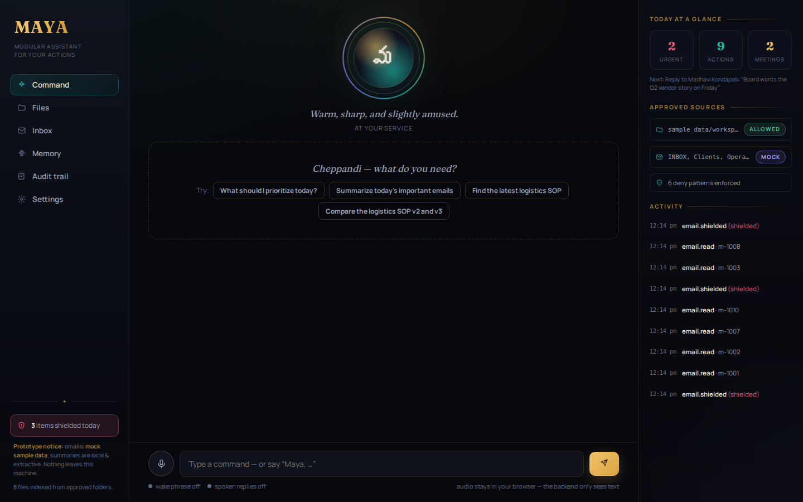
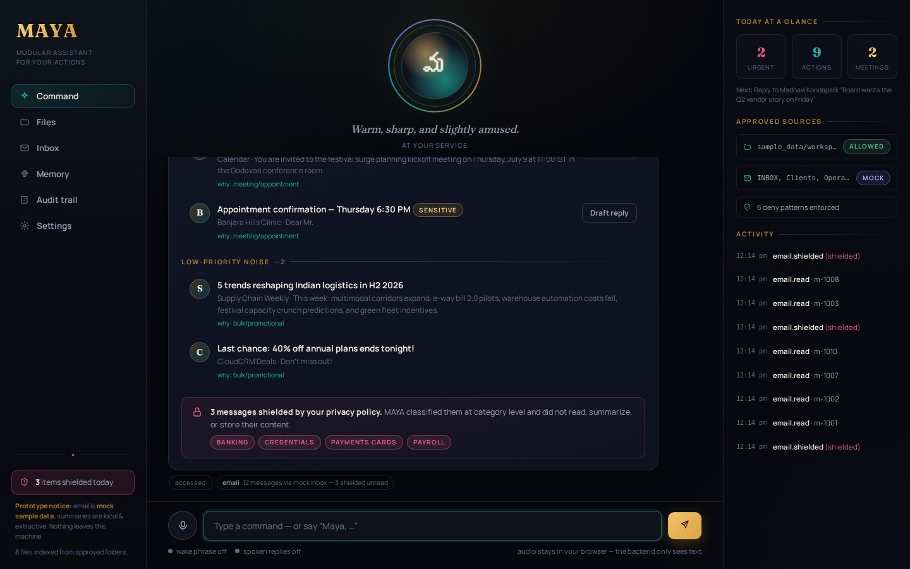

<p align="center">
  
</p>

# MAYA — Modular Assistant for Your Actions

A privacy-first, voice-interactive personal AI assistant prototype with a Telugu-inspired
feminine identity. MAYA searches and summarizes your approved files, digests your inbox,
builds a daily briefing, takes voice commands — and treats your financial and private
data as untouchable by design.

**Everything runs locally.** There are no external service calls at runtime: summarization
is a local extractive engine, email is a clearly-labelled mock connector with fictional
sample data, and voice runs on the browser's own speech stack (audio never reaches the
backend — only text transcripts do).

---

## What works (verified)

| Capability | Status |
|---|---|
| File search over **approved folders only** (keyword, type, folder, "latest") | ✅ real |
| Document summarization — short / medium / detailed | ✅ real (local extractive) |
| Action items, deadlines, entities, risks extraction | ✅ real |
| Compare two documents | ✅ real |
| Daily email digest — urgent / action / meetings / follow-ups / noise | ✅ real logic, **mock inbox** |
| BLOCKED-content shielding (OTPs, payslips, card statements, bank docs…) | ✅ real, tested |
| Redaction of card numbers, PAN, IFSC, Aadhaar-shaped IDs, OTPs, passwords | ✅ real, tested |
| Confirmation gate for move / delete / send (exact action shown first) | ✅ real, tested |
| Reversible delete (→ `data/trash/`, never unlinked) | ✅ real |
| Voice: push-to-talk, wake phrase ("Maya, …"), spoken replies, interruption | ✅ real in Chrome/Edge |
| Persona layer: wit budget, zero humor in sensitive contexts, Telugu flair | ✅ real, tested |
| Memory: explicit-only, Fernet-encrypted, reviewable, deletable, toggleable | ✅ real, tested |
| Audit trail of every access, block, and action | ✅ real |
| Daily briefing (priorities, urgent email, meetings, doc tasks, reminders) | ✅ real |

## What is mocked or stubbed (honestly)

- **Email**: `MockEmailConnector` reads `sample_data/emails/inbox.json` (12 fictional
  messages, including an OTP, a payslip and a card statement so you can watch the
  shielding work). `GmailConnector` is a documented stub that refuses to run without
  OAuth credentials — see `backend/maya/email_connectors/gmail_stub.py` for the real
  integration path. The UI labels all of this "mock".
- **Summarization is not an LLM.** It's a deterministic extractive engine (sentence
  scoring). `LLMSummarizer` in `backend/maya/nlp/summarizer.py` marks exactly where an
  API-backed model would plug in; it raises `NotConfiguredError` rather than pretending.
- **"Send email"**, even after confirmation, writes to `data/outbox.json` with a
  `SIMULATED` transport marker. Nothing is ever transmitted.
- **Voice** depends on the browser: Chrome/Edge have Web Speech API STT; Firefox does
  not (typed chat always works — MAYA is voice-first, not voice-only).

## Privacy model

Content is classified **SAFE / SENSITIVE / BLOCKED** before any use:

- **BLOCKED** — banking, payment cards, investments/demat, tax, payroll, credentials
  (OTPs/passwords/security answers), government IDs (PAN/Aadhaar/SSN), and Luhn-valid
  card numbers. Never summarized, never stored, never displayed. Blocked files are
  indexed as *metadata only*; blocked emails surface as a category-level notice
  ("1 banking email shielded"). This holds even inside approved folders.
- **SENSITIVE** — health, legal, personal matters. Summarized only after redaction,
  flagged in the UI, and the personality layer drops all humor.
- **SAFE** — still passes through token-level redaction (a stray card number in a
  meeting note gets masked anyway).

Plus: allowlisted folders (`config/settings.yaml`) with deny patterns pruned inside them;
a confirmation gate that shows the exact operation before any side effect; an append-only
audit log; per-answer "accessed" chips showing what MAYA touched; Fernet-encrypted memory
that refuses blocked values and can be switched off. If a tradeoff came up between
features and privacy, privacy won.

<p align="center">
  
</p>

## Quick start

```bash
# 1. Backend (Python 3.11+)
python3 -m venv .venv
.venv/bin/pip install -r backend/requirements.txt

# 2. Frontend (Node 18+) — build once, FastAPI serves the result
cd frontend && npm install && npm run build && cd ..

# 3. Run
.venv/bin/python backend/run.py
# → open http://127.0.0.1:8930
```

Voice needs Chrome or Edge (Web Speech API). Details, dev mode, and troubleshooting:
[SETUP.md](SETUP.md). Architecture: [ARCHITECTURE.md](ARCHITECTURE.md). A scripted
walkthrough: [demo/demo_script.md](demo/demo_script.md) or `.venv/bin/python scripts/demo.py`.

## Try these

- “Maya, what should I prioritize today?”
- “Maya, summarize today's important emails.”
- “Maya, find the latest logistics SOP.” → “compare these two files” → “summarize the first one in detail”
- “Maya, summarize the bank statement.” → watch her refuse, politely and plainly
- “delete the festival campaign ideas” → the confirmation drawer shows the exact
  reversible operation; say “cancel” (or click) and nothing changes
- “remember that I prefer short summaries” · “show memory” · “forget the summaries thing”

## Tests

```bash
.venv/bin/python -m pytest backend/tests -q     # 91 tests
```

Covered: sensitivity classification, redaction, approved-folder search (including the
non-approved `private_vault` staying invisible), summarization modes, digest bucketing
and shield leak-checks, memory encryption/refusals, persona guardrails (no humor when
sensitive, wit budget), intent parsing for the voice commands, confirmation gating
(nothing executes unconfirmed; cancel leaves files untouched), and end-to-end API flows.

## Configuration

- `config/settings.yaml` — approved folders, deny patterns, email labels, VIP senders,
  voice, memory, server port.
- `config/policy.yaml` — blocked/sensitive keyword rules, redaction regexes, action
  risk table (safe / gated / forbidden).
- `config/personality.yaml` — identity, tone rules, reviewed quip pools, hard guardrails.

## Limitations

1. Summaries are extractive (the document's own sentences) — competent for business
   docs, not an LLM. The plug-in point exists and is not configured.
2. Email is mock data; the Gmail stub documents but does not implement OAuth.
3. Voice quality depends on the OS/browser voices; wake-phrase mode keeps the mic
   open in-browser (clearly indicated) and Firefox lacks STT entirely.
4. Single local user; no auth; binds to 127.0.0.1 by default.
5. The memory encryption key lives in `data/maya.key` (0600) — a production build
   would use the OS keychain.
6. PPTX is not indexed (PDF/DOCX/TXT/MD/CSV are).
7. Intent parsing is rule-based; it handles the documented command families well but
   it is not open-ended natural language understanding.

## Repo map

```
backend/maya/      FastAPI app + policy, files, nlp, email, voice, memory, audit,
                   persona, orchestrator modules   (see ARCHITECTURE.md)
backend/tests/     pytest suite (91 tests)
frontend/          React + Vite UI (hand-built design system, no component library)
config/            settings.yaml · policy.yaml · personality.yaml
sample_data/       fictional Dhruva Freight workspace + mock inbox + private_vault
demo/              demo_script.md — guided UI walkthrough
scripts/demo.py    scripted CLI demo of the core flows
PLAN.md · PROGRESS.md · TODO.md — the build's working documents
```
